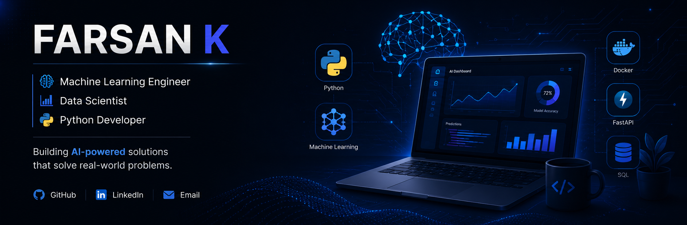

```markdown
<div align="center">

<!-- HEADER BANNER - Replace with your own banner image -->


</div>

---

<div align="center">

# Hi, I'm **Farsan K**
### Machine Learning Engineer | Data Scientist | Python Developer


</div>

---

## About Me


I am a passionate **Machine Learning Engineer** who loves turning data into actionable insights and building end-to-end AI solutions. I enjoy working on real-world problems that create value and make a difference.

Machine Learning & Deep Learning  
Data Analysis & Visualization  
Model Deployment & MLOps  
API Development with FastAPI  
Working with SQL & Databases  
Building Scalable AI Solutions  

**Kerala, India**  
**LinkedIn:** [linkedin.com/in/farsan-k](https://linkedin.com/in/farsan-k)  
**Email:** farsankk2004@gmail.com  

---

## Tech Stack

### Languages


### Data Science


### Visualization


### Backend & Tools


### Databases


---

## Featured Projects

<div align="center">
<table>
<tr>

<td width="33%" valign="top">

### AI-Powered Mobile Addiction Prediction
Predicts mobile addiction risk using ML. Deployed with FastAPI.


</td>

<td width="33%" valign="top">

### Predictive Maintenance System
Anomaly detection in industrial machines using Isolation Forest & DBSCAN.


</td>

<td width="33%" valign="top">

### Cinema Audience Forecasting
Predicts movie audience attendance using ML regression models.


</td>

</tr>
<tr>

<td width="33%" valign="top">

### UPI Transaction Analysis Dashboard
Interactive Power BI dashboard for UPI transaction insights and KPIs.


</td>

<td width="33%" valign="top">

### Market Basket Analysis
Association rule mining to find product relationships using Apriori algorithm.


</td>

<td width="33%" valign="top">

### Job Market EDA
Exploratory data analysis on job market dataset to uncover insights.


</td>

</tr>
</table>
</div>

---

## GitHub Statistics

<div align="center">


</div>

<div align="center">


</div>

<div align="center">

| Total Repos | Total Stars | Contributions | This Year |
|:-----------:|:-----------:|:-------------:|:---------:|
| **14** | **24** | **771** | **771** |

</div>

---

## Contribution Graph

<div align="center">


</div>

---

## LeetCode

<div align="center">

<a href="https://leetcode.com/u/farsan_k" target="_blank">
  
</a>

| Problems Solved | Contest Rating | Contests Participated |
|:---------------:|:--------------:|:---------------------:|
| **600+** | **150+** | **50+** |

</div>

---

## GitHub Trophies

<div align="center">


</div>

---

## Connect With Me

<div align="center">

[](https://linkedin.com/in/farsan-k)
[](https://github.com/Farsan-k)
[](https://leetcode.com/u/farsan_k)
[](mailto:farsankk2004@gmail.com)

</div>

---

<div align="center">

### If you like my work, consider giving a star to my repositories!


</div>
```
